# C 跑腿任务与虚拟宠物 设计初稿

> 版本：V1（待组内评审）
>
> 范围：M7 跑腿任务 FR-30—35、M8 虚拟宠物 FR-36—37、NFR-03；交叉涉及 FR-29、NFR-02 / 04 / 05 / 06。
>
> 依据：仓库中的《校园社区SRS初稿》和《用户故事清单》。故事编号与 FR / NFR 编号分属两套编号，映射见 §5。
>
> 组织方式沿用 M4：设计前提、类图、状态图、时序图、跨模块约定、需求覆盖。每张图保留 Mermaid 源码，并在 `C-fig/` 提供同编号 PNG；可直接查看图片，或修改源码后重新导出。
>
> 约定：实线 `--` 表示关联，虚线 `..>` 表示依赖；Service 表示模块责任边界，不要求拆成微服务。接口、权限点和事件名均为设计提案，待全组统一。

## 0. 设计前提（待组内确认）

| 编号 | 暂采用的口径 | 依据与影响 |
| --- | --- | --- |
| C1 | 主链路为 `OPEN → ACCEPTED → AWAITING_CONFIRMATION → COMPLETED`；另有 `CANCELLED / EXPIRED` | 对应 SRS 附录 B；`EXPIRED` 是本设计补充，须评审，不将草稿作为已发布任务持久化 |
| C2 | `deadlineAt` 暂作接单截止时间；仅未接单任务到期变为 `EXPIRED`；已接单任务不自动取消 | SRS 明确过期不可接取，但未明确接单后超时规则；后续调整须同步 §2.1 / §3.3 |
| C3 | 报酬使用正数、最多两位小数的金额，存储为整数分 `rewardCents`；上限待确认 | 本期仅记录信息，不接入支付、退款、赔付、余额或担保 |
| C4 | 每个任务最多一条待处理取消申请；提出申请不改变任务状态；申请待处理期间暂停提交完成与确认完成 | 防止同意取消与完成互相覆盖；拒绝后解除暂停。撤回、超时自动同意不在本初稿流程中 |
| C5 | 纠纷状态与任务状态分开；提交纠纷只建立 `PENDING` 记录，不自动冻结或改变任务状态 | 同一任务最多一条待处理纠纷；已接单及有接单人的历史终态均可反馈；受理时限待确认 |
| C6 | 管理员默认可仅保存处理意见；必要状态调整暂允许 `ACCEPTED / AWAITING_CONFIRMATION → CANCELLED` 或 `AWAITING_CONFIRMATION → COMPLETED` | 不允许恢复终态、改换接单人或直接将未提交完成的任务认定完成；调整须有独立权限、理由及审计，具体范围待确认 |
| C7 | 每用户最多一个宠物；初始成长值为 0；签到奖励、阶段名称及阈值以版本化成长规则配置 | 不虚构正式奖励数值；规则阈值从 0 起严格递增，阶段由成长值计算；规则变更不回算既有签到奖励 |
| C8 | 签到日期由服务端按 `Asia/Shanghai` 自然日确定，在请求进入业务服务时固定；不接受客户端日期和补签 | 跨零点重试按新请求日期处理；事务重试沿用本次已确定日期，日期口径须与前端提示一致 |
| C9 | 登录、用户和管理授权复用 A 及共享权限能力；C 校验任务参与关系和宠物归属 | 未登录 401，管理权限不足 403；本人专属资源不存在或无权读取时返回 404；越权不返回私人字段 |
| C10 | 业务记录与待投递事件同事务保存，提交后调用 D 的通知接口；投递失败可重试，接收端按事件号去重 | 以持久事件防止“已提交但通知丢失”；通知失败不回滚成功业务，最终可从业务页查询结果 |
| C11 | 跑腿发布使用 `(userId, operation, requestKey)` 唯一键和请求摘要；相同键及相同内容返回原结果，不同内容返回冲突 | 覆盖故事25 / NFR-04，与 B 统一协议；幂等记录与任务同事务保存，保留期及重试窗口待确认 |

以上为可供评审的设计选择，不代表已完成跨模块联调。特别是任务超时、取消申请期间的完成策略、管理员状态调整范围及宠物成长规则，需在实现前确认。

## 1. 类图

### 1.1 跑腿任务核心类图

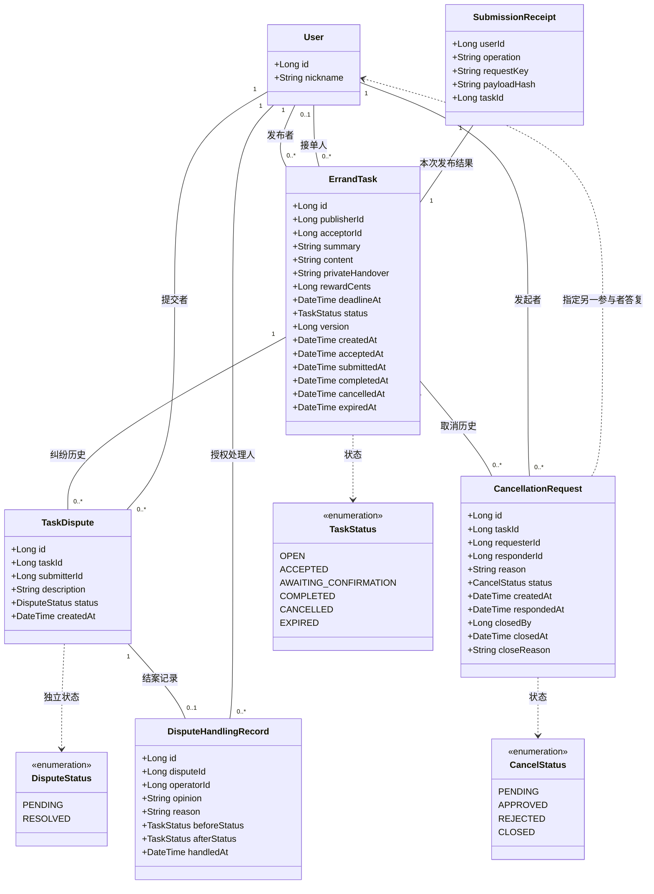
```mermaid
classDiagram
    direction TB
    class User {
        +Long id
        +String nickname
    }
    class ErrandTask {
        +Long id
        +Long publisherId
        +Long acceptorId
        +String summary
        +String content
        +String privateHandover
        +Long rewardCents
        +DateTime deadlineAt
        +TaskStatus status
        +Long version
        +DateTime createdAt
        +DateTime acceptedAt
        +DateTime submittedAt
        +DateTime completedAt
        +DateTime cancelledAt
        +DateTime expiredAt
    }
    class CancellationRequest {
        +Long id
        +Long taskId
        +Long requesterId
        +Long responderId
        +String reason
        +CancelStatus status
        +DateTime createdAt
        +DateTime respondedAt
        +Long closedBy
        +DateTime closedAt
        +String closeReason
    }
    class TaskDispute {
        +Long id
        +Long taskId
        +Long submitterId
        +String description
        +DisputeStatus status
        +DateTime createdAt
    }
    class DisputeHandlingRecord {
        +Long id
        +Long disputeId
        +Long operatorId
        +String opinion
        +String reason
        +TaskStatus beforeStatus
        +TaskStatus afterStatus
        +DateTime handledAt
    }
    class SubmissionReceipt {
        +Long userId
        +String operation
        +String requestKey
        +String payloadHash
        +Long taskId
    }
    class TaskStatus {
        <<enumeration>>
        OPEN
        ACCEPTED
        AWAITING_CONFIRMATION
        COMPLETED
        CANCELLED
        EXPIRED
    }
    class CancelStatus {
        <<enumeration>>
        PENDING
        APPROVED
        REJECTED
        CLOSED
    }
    class DisputeStatus {
        <<enumeration>>
        PENDING
        RESOLVED
    }
    User "1" -- "0..*" ErrandTask : 发布者
    User "0..1" -- "0..*" ErrandTask : 接单人
    ErrandTask "1" -- "0..*" CancellationRequest : 取消历史
    User "1" -- "0..*" CancellationRequest : 发起者
    CancellationRequest ..> User : 指定另一参与者答复
    ErrandTask "1" -- "0..*" TaskDispute : 纠纷历史
    User "1" -- "0..*" TaskDispute : 提交者
    TaskDispute "1" -- "0..1" DisputeHandlingRecord : 结案记录
    User "1" -- "0..*" DisputeHandlingRecord : 授权处理人
    SubmissionReceipt "1" -- "1" ErrandTask : 本次发布结果
    ErrandTask ..> TaskStatus : 状态
    CancellationRequest ..> CancelStatus : 状态
    TaskDispute ..> DisputeStatus : 独立状态
```

要点：

- `User` 由 A 维护，仅引用必要字段；`acceptorId` 在接单前为空，接单后必须存在且不同于 `publisherId`。已取消任务保留参与者，不删除历史关联。
- 任务、取消申请和纠纷各自有状态，不能将“已申请取消”或“存在纠纷”写进任务主状态来替换业务进度。
- 数据库约束：每任务最多一条 `PENDING` 取消申请、最多一条 `PENDING` 纠纷；技术栈确定后采用条件唯一索引或等效约束，并统一锁定任务行串行化创建与状态变更。
- `DisputeHandlingRecord` 保存业务意见、状态前后值和调整理由，只追加，不向执行者提供修改或删除入口；共享 `AdminAuditLog` 另外保存管理审计，不用它替代业务意见。
- `SubmissionReceipt` 是 C 侧逻辑模型，若 B 提供共享幂等组件则复用，不再建设第二份幂等存储。成功发布的回执与任务一一关联，创建失败不留下成功回执。

### 1.2 宠物与签到类图

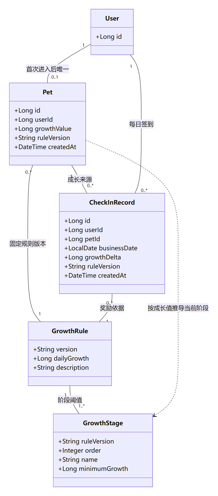

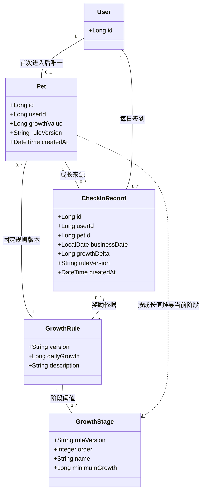
```mermaid
classDiagram
    direction TB
    class User {
        +Long id
    }
    class Pet {
        +Long id
        +Long userId
        +Long growthValue
        +String ruleVersion
        +DateTime createdAt
    }
    class CheckInRecord {
        +Long id
        +Long userId
        +Long petId
        +LocalDate businessDate
        +Long growthDelta
        +String ruleVersion
        +DateTime createdAt
    }
    class GrowthRule {
        +String version
        +Long dailyGrowth
        +String description
    }
    class GrowthStage {
        +String ruleVersion
        +Integer order
        +String name
        +Long minimumGrowth
    }
    User "1" -- "0..1" Pet : 首次进入后唯一
    Pet "1" -- "0..*" CheckInRecord : 成长来源
    User "1" -- "0..*" CheckInRecord : 每日签到
    Pet "0..*" -- "1" GrowthRule : 固定规则版本
    CheckInRecord "0..*" -- "1" GrowthRule : 奖励依据
    GrowthRule "1" -- "1..*" GrowthStage : 阶段阈值
    Pet ..> GrowthStage : 按成长值推导当前阶段
```

要点：

- `Pet.userId` 唯一；用户未进入宠物页时可没有宠物，首次初始化成功后为一对一，不提供删除后重建来重复领奖。
- `CheckInRecord(userId, businessDate)` 唯一；`petId`、`userId` 须对应同一归属，可用组合外键或等效数据库约束保证。
- 阶段不额外保存一份可独立修改的数据：选择同规则版本中 `minimumGrowth <= growthValue` 的最大阈值阶段。响应同时返回规则版本、成长值、当前阶段及规则说明。
- 成长规则版本一经用于宠物或签到即保持不可变；规则升级、宠物迁移由全组另定方案。本期只通过签到增加成长值，因此应满足 `growthValue = SUM(growthDelta)`，初始值为 0。

## 2. 状态图

### 2.1 跑腿任务生命周期

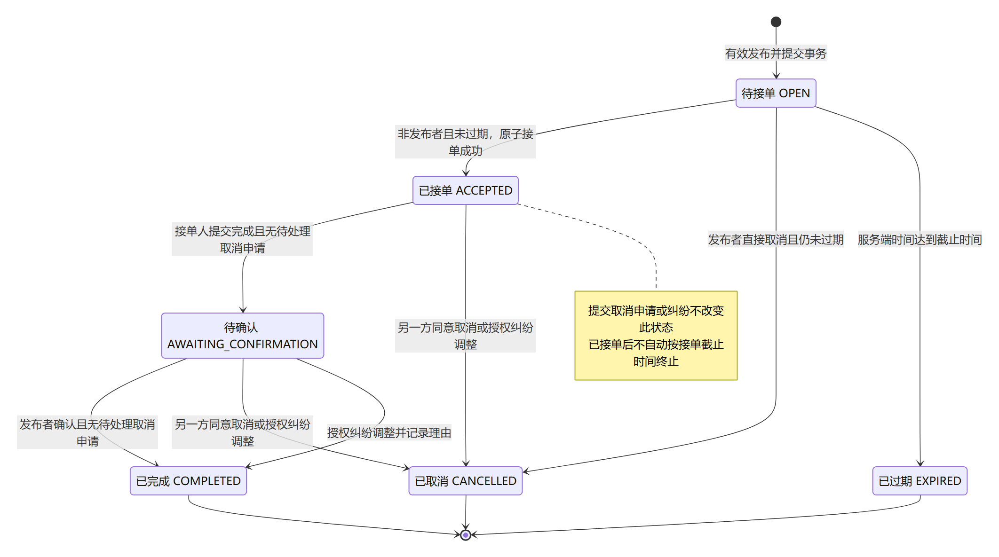

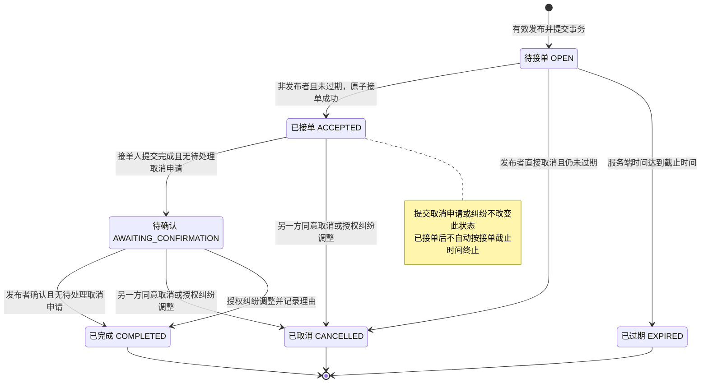
```mermaid
stateDiagram-v2
    direction TB
    state "待接单 OPEN" as Open
    state "已接单 ACCEPTED" as Accepted
    state "待确认 AWAITING_CONFIRMATION" as Awaiting
    state "已完成 COMPLETED" as Completed
    state "已取消 CANCELLED" as Cancelled
    state "已过期 EXPIRED" as Expired
    [*] --> Open : 有效发布并提交事务
    Open --> Accepted : 非发布者且未过期，原子接单成功
    Open --> Cancelled : 发布者直接取消且仍未过期
    Open --> Expired : 服务端时间达到截止时间
    Accepted --> Awaiting : 接单人提交完成且无待处理取消申请
    Awaiting --> Completed : 发布者确认且无待处理取消申请
    Accepted --> Cancelled : 另一方同意取消或授权纠纷调整
    Awaiting --> Cancelled : 另一方同意取消或授权纠纷调整
    Awaiting --> Completed : 授权纠纷调整并记录理由
    Completed --> [*]
    Cancelled --> [*]
    Expired --> [*]
    note right of Accepted
        提交取消申请或纠纷不改变此状态
        已接单后不自动按接单截止时间终止
    end note
```

要点：

- 到期判断使用服务端数据库时间，边界为 `now >= deadlineAt`；接单原子更新必须包含 `deadlineAt > now`，不能只依赖定时任务。
- 查询时可计算有效 `EXPIRED` 状态，定时任务仅将仍为 `OPEN` 的到期任务持久化为 `EXPIRED`，避免页面误示待接单；本人历史列表保留过期记录。
- 接单、直接取消、到期处理竞争同一任务行；同意取消、提交完成、确认完成及管理员调整也遵循同一行锁 / 版本校验协议，每次变更递增 `version`。
- `COMPLETED / CANCELLED / EXPIRED` 为终态，不可再接单、提交完成、确认完成或通过管理员恢复。终态纠纷仍可保存意见。

### 2.2 取消申请生命周期

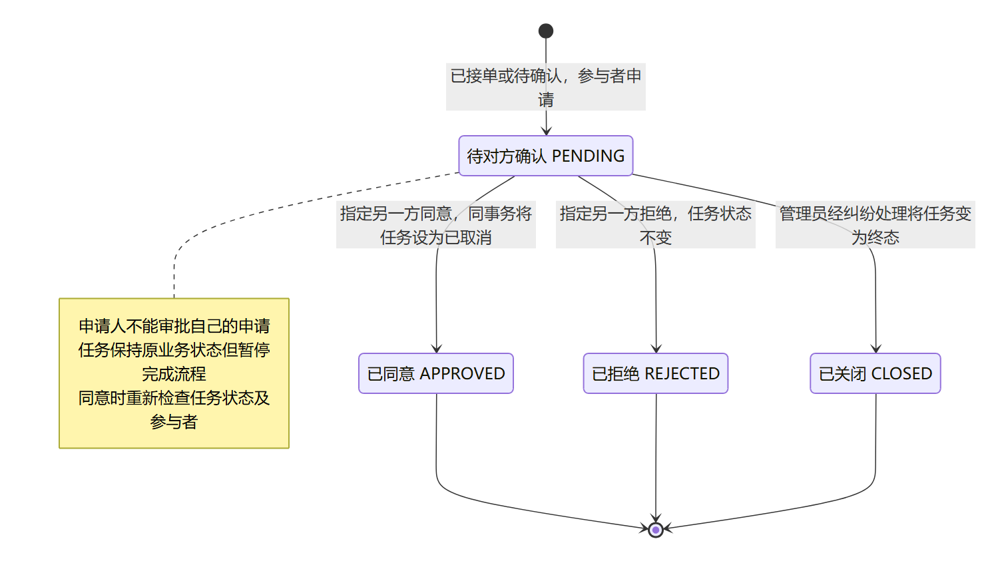

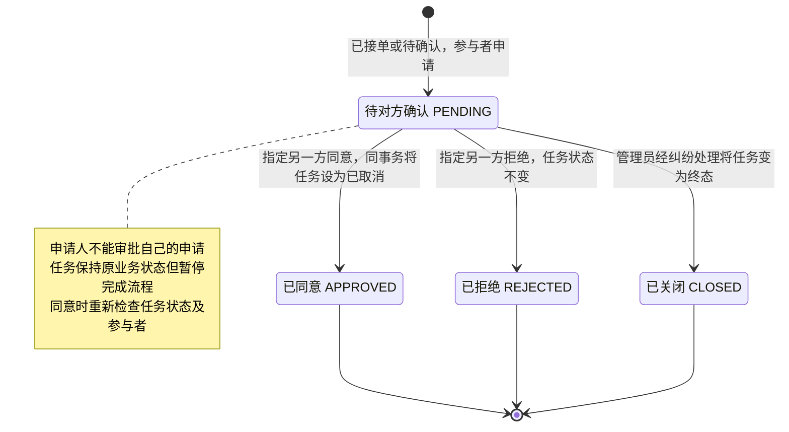
```mermaid
stateDiagram-v2
    direction TB
    state "待对方确认 PENDING" as Pending
    state "已同意 APPROVED" as Approved
    state "已拒绝 REJECTED" as Rejected
    state "已关闭 CLOSED" as Closed
    [*] --> Pending : 已接单或待确认，参与者申请
    Pending --> Approved : 指定另一方同意，同事务将任务设为已取消
    Pending --> Rejected : 指定另一方拒绝，任务状态不变
    Pending --> Closed : 管理员经纠纷处理将任务变为终态
    Approved --> [*]
    Rejected --> [*]
    Closed --> [*]
    note right of Pending
        申请人不能审批自己的申请
        任务保持原业务状态但暂停完成流程
        同意时重新检查任务状态及参与者
    end note
```

要点：

- 待接单任务直接取消，不创建需要双方处理的申请。
- `APPROVED` 与任务 `CANCELLED` 同事务提交；`REJECTED` 不改变任务状态。拒绝后可新建申请，历史申请不复用、不删除。
- 同一待处理申请的重复提交返回已有记录；另一方再申请时提示先处理已有申请。重复答复返回既有结果，不能改写已生效的决定。
- `CLOSED` 用来保留因管理员调整而失效的申请，关闭理由及操作人必须保存；它不同于另一参与者拒绝。

### 2.3 宠物初始化与成长

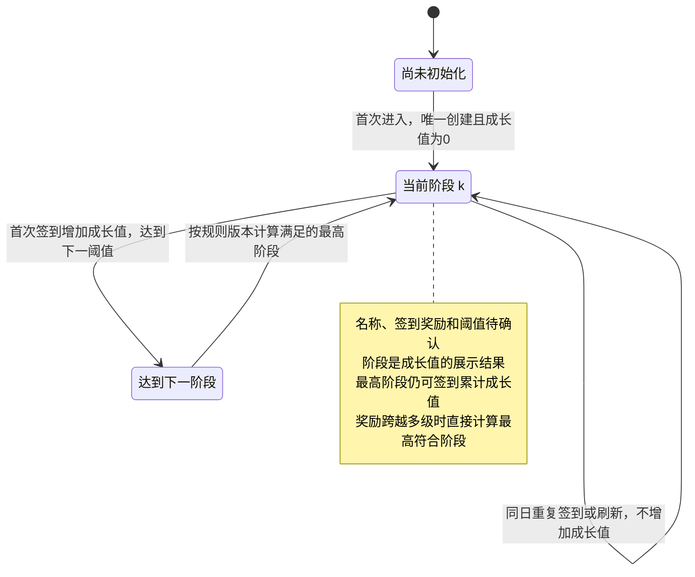
```mermaid
stateDiagram-v2
    direction TB
    state "尚未初始化" as Absent
    state "当前阶段 k" as Current
    state "达到下一阶段" as Next
    [*] --> Absent
    Absent --> Current : 首次进入，唯一创建且成长值为0
    Current --> Current : 首次签到增加成长值，未达到下一阈值
    Current --> Next : 首次签到增加成长值，达到下一阈值
    Next --> Current : 按规则版本计算满足的最高阶段
    Current --> Current : 同日重复签到或刷新，不增加成长值
    note right of Current
        名称、签到奖励和阈值待确认
        阶段是成长值的展示结果
        最高阶段仍可签到累计成长值
        奖励跨越多级时直接计算最高符合阶段
    end note
```

要点：本图说明业务成长过程，并不要求将“尚未初始化”或“达到下一阶段”存成数据库状态。成长值、规则版本与签到记录是持久化依据。

## 3. 时序图

以下用五个以内参与者展示关键业务边界；“用户前端”合并使用者与页面，鉴权包含会话校验，控制器参数映射合并到业务服务。所有修改失败均回滚本次业务事务，不产生成功通知。

### 3.1 浏览任务和查看本人任务（FR-30 / FR-33）

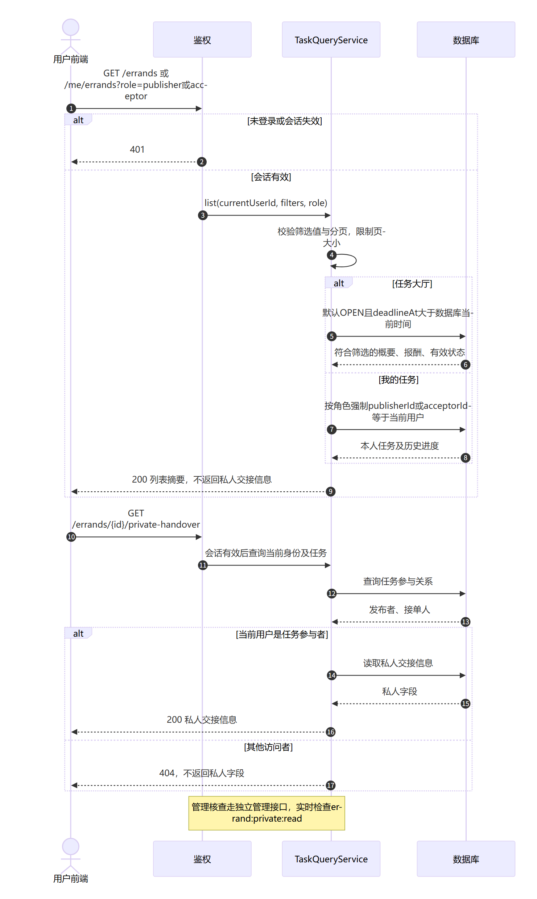

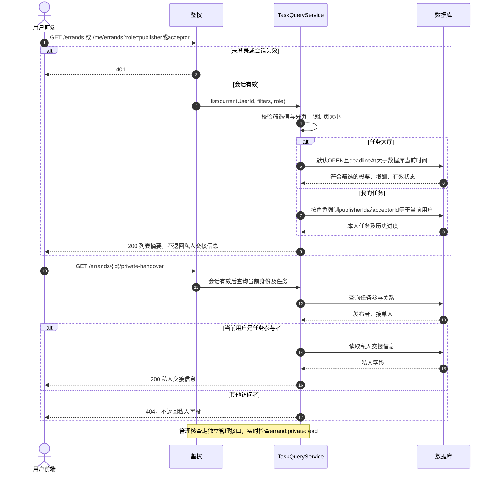
```mermaid
sequenceDiagram
    autonumber
    actor FE as 用户前端
    participant Auth as 鉴权
    participant S as TaskQueryService
    participant DB as 数据库
    FE->>Auth: GET /errands 或 /me/errands?role=publisher或acceptor
    alt 未登录或会话失效
        Auth-->>FE: 401
    else 会话有效
        Auth->>S: list(currentUserId, filters, role)
        S->>S: 校验筛选值与分页，限制页大小
        alt 任务大厅
            S->>DB: 默认OPEN且deadlineAt大于数据库当前时间
            DB-->>S: 符合筛选的概要、报酬、有效状态
        else 我的任务
            S->>DB: 按角色强制publisherId或acceptorId等于当前用户
            DB-->>S: 本人任务及历史进度
        end
        S-->>FE: 200 列表摘要，不返回私人交接信息
    end
    FE->>Auth: GET /errands/{id}/private-handover
    Auth->>S: 会话有效后查询当前身份及任务
    S->>DB: 查询任务参与关系
    DB-->>S: 发布者、接单人
    alt 当前用户是任务参与者
        S->>DB: 读取私人交接信息
        DB-->>S: 私人字段
        S-->>FE: 200 私人交接信息
    else 其他访问者
        S-->>FE: 404，不返回私人字段
    end
    Note over Auth,S: 管理核查走独立管理接口，实时检查errand:private:read
```

要点：

- 显式筛选可以查看历史状态，但过期任务始终不能接取；具体筛选项及排序字段待评审，初稿支持状态、报酬范围与分页，默认按发布时间倒序。
- `/me/errands` 不接收可覆盖会话身份的用户编号；一般详情只返回公开业务内容，私人交接字段使用独立 DTO 和独立查询，不能由前端隐藏来保护。
- 授权管理员通过 `GET /admin/errands/{id}/private-handover` 读取最小核查字段，校验 `errand:private:read`；无权限返回 403。具备一般管理员角色不等于拥有此权限，通知载荷也不携带私人信息。

### 3.2 发布任务（FR-31 / NFR-04）

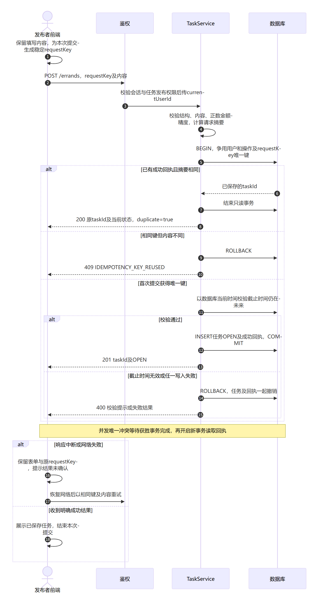

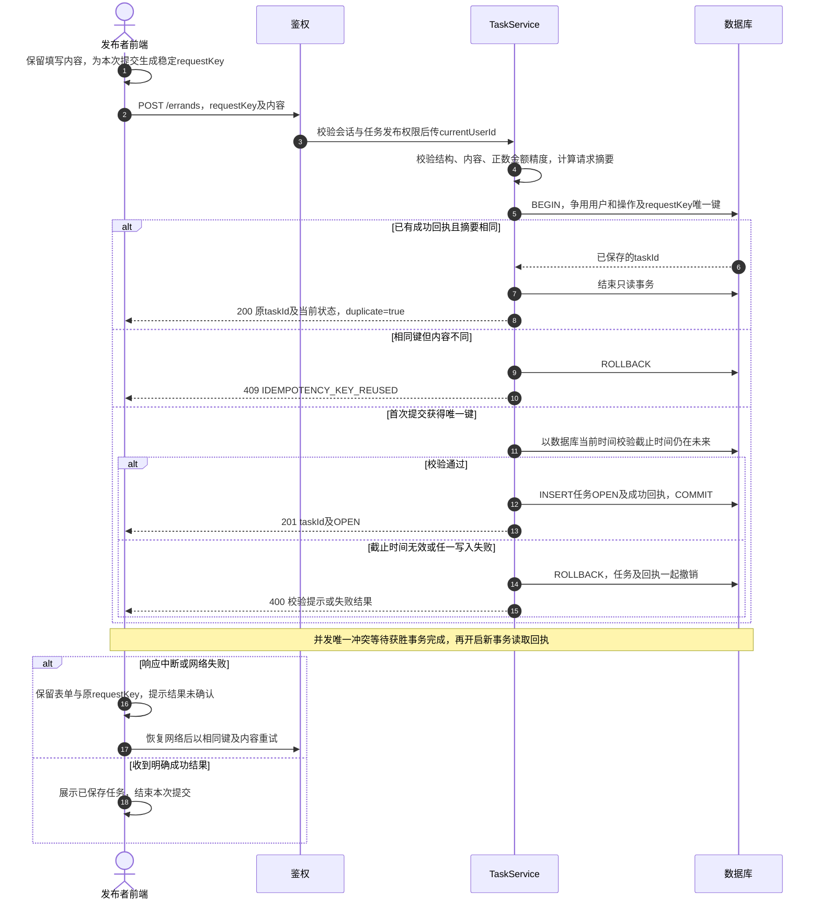
```mermaid
sequenceDiagram
    autonumber
    actor FE as 发布者前端
    participant Auth as 鉴权
    participant S as TaskService
    participant DB as 数据库
    FE->>FE: 保留填写内容，为本次提交生成稳定requestKey
    FE->>Auth: POST /errands，requestKey及内容
    Auth->>S: 校验会话与任务发布权限后传currentUserId
    S->>S: 校验结构、内容、正数金额精度，计算请求摘要
    S->>DB: BEGIN，争用用户和操作及requestKey唯一键
    alt 已有成功回执且摘要相同
        DB-->>S: 已保存的taskId
        S->>DB: 结束只读事务
        S-->>FE: 200 原taskId及当前状态，duplicate=true
    else 相同键但内容不同
        S->>DB: ROLLBACK
        S-->>FE: 409 IDEMPOTENCY_KEY_REUSED
    else 首次提交获得唯一键
        S->>DB: 以数据库当前时间校验截止时间仍在未来
        alt 校验通过
            S->>DB: INSERT任务OPEN及成功回执，COMMIT
            S-->>FE: 201 taskId及OPEN
        else 截止时间无效或任一写入失败
            S->>DB: ROLLBACK，任务及回执一起撤销
            S-->>FE: 400 校验提示或失败结果
        end
    end
    Note over FE,DB: 并发唯一冲突等待获胜事务完成，再开启新事务读取回执
    alt 响应中断或网络失败
        FE->>FE: 保留表单与原requestKey，提示结果未确认
        FE->>Auth: 恢复网络后以相同键及内容重试
    else 收到明确成功结果
        FE->>FE: 展示已保存任务，结束本次提交
    end
```

要点：

- 校验空白内容、长度、金额格式、截止时间；具体长度、金额上限待确认。请求中的 `publisherId`、初始状态和接单人不能由客户端指定。
- 幂等查询优先于针对“首次创建”的动态截止时间校验：已成功发布但响应丢失的请求，即使重试时截止时间已到，也能获得原任务结果，不新建任务。
- 未送达请求重试时若截止时间已过，返回明确校验失败并保留表单；成功持久化但响应中断时沿用原键取回结果。用户修改内容再提交时使用新键，不依靠按钮禁用保证去重。
- 数据库唯一冲突后须先回滚失败事务，再用新事务回查成功回执；获胜事务若回滚则允许重试争用，不把异常当作成功。

### 3.3 接单（FR-32 / NFR-03）

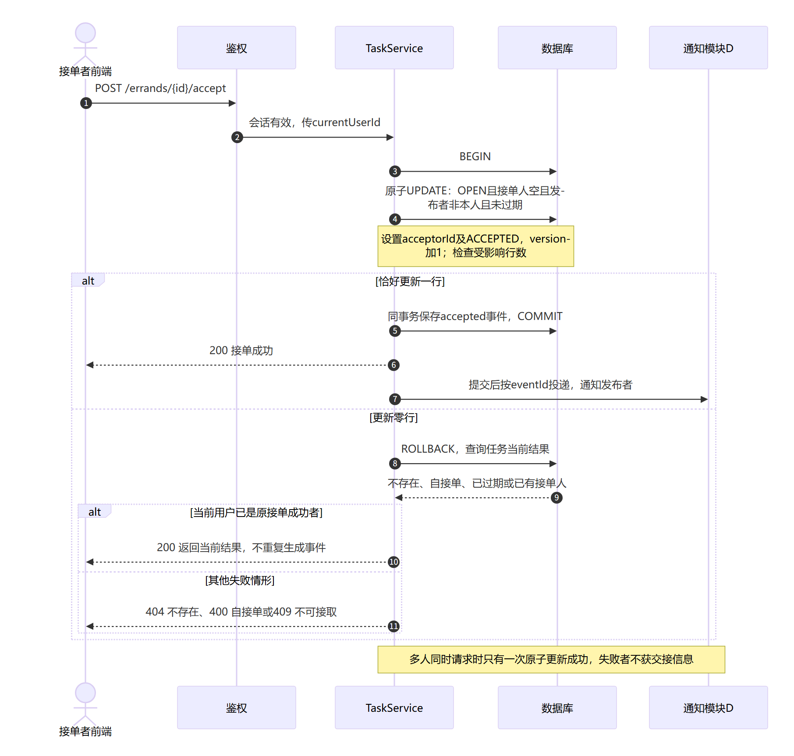

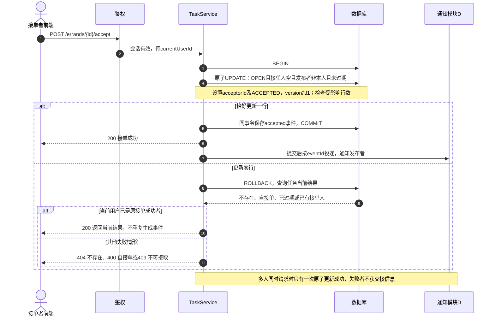
```mermaid
sequenceDiagram
    autonumber
    actor FE as 接单者前端
    participant Auth as 鉴权
    participant S as TaskService
    participant DB as 数据库
    participant N as 通知模块D
    FE->>Auth: POST /errands/{id}/accept
    Auth->>S: 会话有效，传currentUserId
    S->>DB: BEGIN
    S->>DB: 原子UPDATE：OPEN且接单人空且发布者非本人且未过期
    Note over S,DB: 设置acceptorId及ACCEPTED，version加1；检查受影响行数
    alt 恰好更新一行
        S->>DB: 同事务保存accepted事件，COMMIT
        S-->>FE: 200 接单成功
        S->>N: 提交后按eventId投递，通知发布者
    else 更新零行
        S->>DB: ROLLBACK，查询任务当前结果
        DB-->>S: 不存在、自接单、已过期或已有接单人
        alt 当前用户已是原接单成功者
            S-->>FE: 200 返回当前结果，不重复生成事件
        else 其他失败情形
            S-->>FE: 404 不存在、400 自接单或409 不可接取
        end
    end
    Note over S,N: 多人同时请求时只有一次原子更新成功，失败者不获交接信息
```

要点：不使用“先查待接单、再无条件更新”的流程；到期、参与者和接单人条件必须进入同一原子更新。已接单者重试只返回已保存结果，即使任务后来进入终态，也不得表现成重新接单成功。

### 3.4 提交完成与确认完成（FR-31 / FR-32）

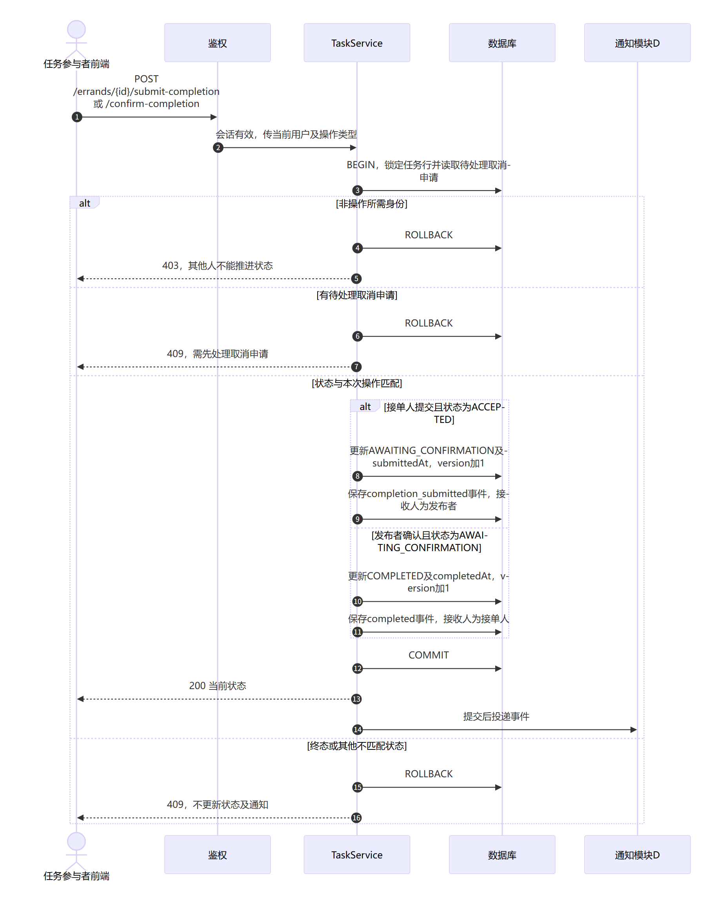

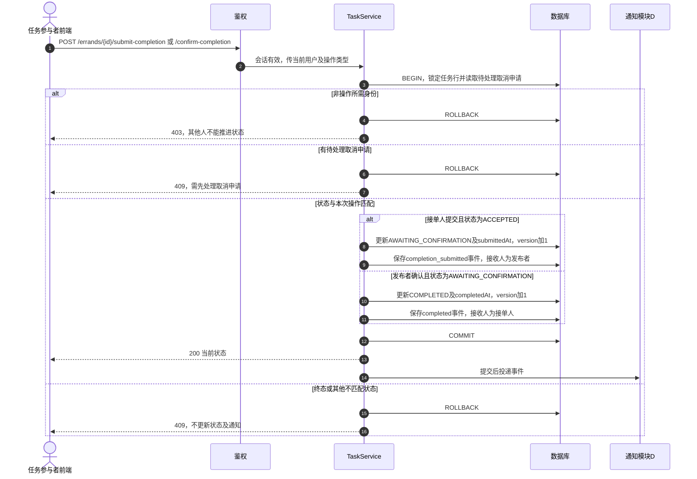
```mermaid
sequenceDiagram
    autonumber
    actor FE as 任务参与者前端
    participant Auth as 鉴权
    participant S as TaskService
    participant DB as 数据库
    participant N as 通知模块D
    FE->>Auth: POST /errands/{id}/submit-completion 或 /confirm-completion
    Auth->>S: 会话有效，传当前用户及操作类型
    S->>DB: BEGIN，锁定任务行并读取待处理取消申请
    alt 非操作所需身份
        S->>DB: ROLLBACK
        S-->>FE: 403，其他人不能推进状态
    else 有待处理取消申请
        S->>DB: ROLLBACK
        S-->>FE: 409，需先处理取消申请
    else 状态与本次操作匹配
        alt 接单人提交且状态为ACCEPTED
            S->>DB: 更新AWAITING_CONFIRMATION及submittedAt，version加1
            S->>DB: 保存completion_submitted事件，接收人为发布者
        else 发布者确认且状态为AWAITING_CONFIRMATION
            S->>DB: 更新COMPLETED及completedAt，version加1
            S->>DB: 保存completed事件，接收人为接单人
        end
        S->>DB: COMMIT
        S-->>FE: 200 当前状态
        S->>N: 提交后投递事件
    else 终态或其他不匹配状态
        S->>DB: ROLLBACK
        S-->>FE: 409，不更新状态及通知
    end
```

要点：角色来自服务端任务记录，不采信请求中的角色。终态重复请求返回当前状态及冲突提示，不再推进状态；完成与取消共用任务锁，不能分别检查后并行覆盖。

### 3.5 取消任务（FR-34）

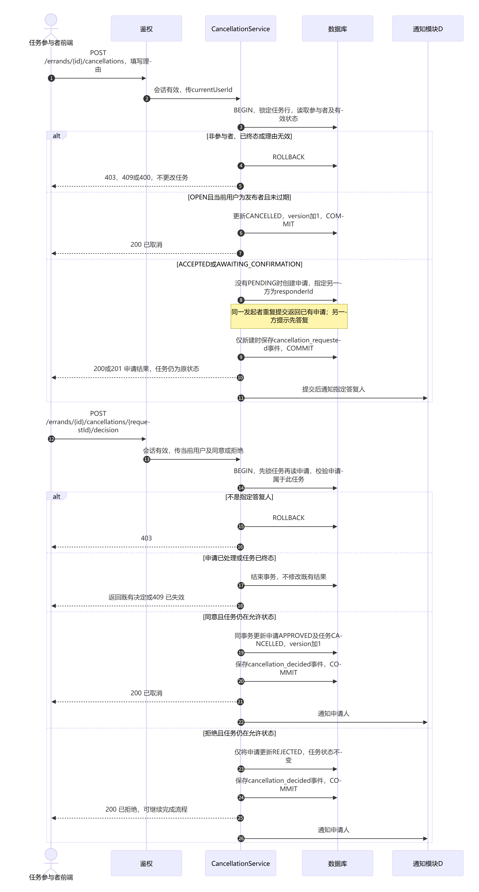

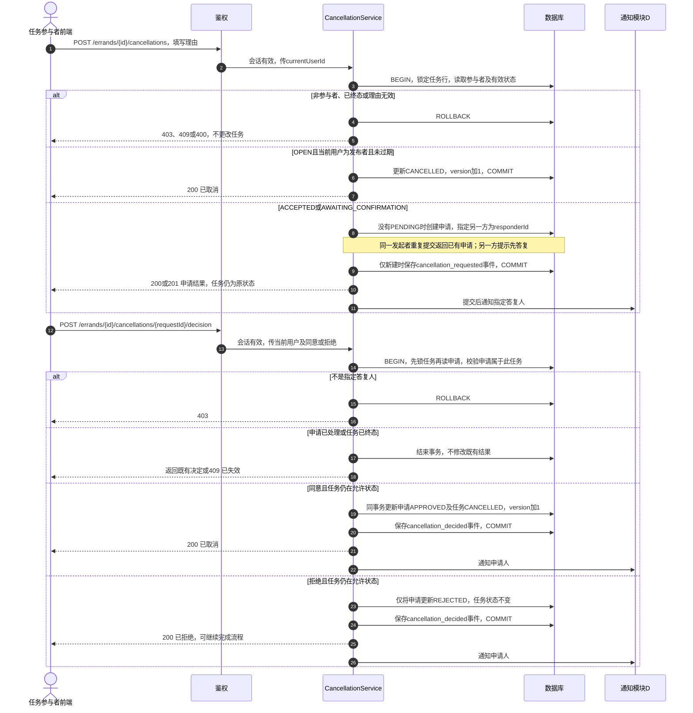
```mermaid
sequenceDiagram
    autonumber
    actor FE as 任务参与者前端
    participant Auth as 鉴权
    participant S as CancellationService
    participant DB as 数据库
    participant N as 通知模块D
    FE->>Auth: POST /errands/{id}/cancellations，填写理由
    Auth->>S: 会话有效，传currentUserId
    S->>DB: BEGIN，锁定任务行，读取参与者及有效状态
    alt 非参与者、已终态或理由无效
        S->>DB: ROLLBACK
        S-->>FE: 403、409或400，不更改任务
    else OPEN且当前用户为发布者且未过期
        S->>DB: 更新CANCELLED，version加1，COMMIT
        S-->>FE: 200 已取消
    else ACCEPTED或AWAITING_CONFIRMATION
        S->>DB: 没有PENDING时创建申请，指定另一方为responderId
        Note over S,DB: 同一发起者重复提交返回已有申请；另一方提示先答复
        S->>DB: 仅新建时保存cancellation_requested事件，COMMIT
        S-->>FE: 200或201 申请结果，任务仍为原状态
        S->>N: 提交后通知指定答复人
    end
    FE->>Auth: POST /errands/{id}/cancellations/{requestId}/decision
    Auth->>S: 会话有效，传当前用户及同意或拒绝
    S->>DB: BEGIN，先锁任务再读申请，校验申请属于此任务
    alt 不是指定答复人
        S->>DB: ROLLBACK
        S-->>FE: 403
    else 申请已处理或任务已终态
        S->>DB: 结束事务，不修改既有结果
        S-->>FE: 返回既有决定或409 已失效
    else 同意且任务仍在允许状态
        S->>DB: 同事务更新申请APPROVED及任务CANCELLED，version加1
        S->>DB: 保存cancellation_decided事件，COMMIT
        S-->>FE: 200 已取消
        S->>N: 通知申请人
    else 拒绝且任务仍在允许状态
        S->>DB: 仅将申请更新REJECTED，任务状态不变
        S->>DB: 保存cancellation_decided事件，COMMIT
        S-->>FE: 200 已拒绝，可继续完成流程
        S->>N: 通知申请人
    end
```

要点：申请创建、答复、完成及管理员调整都先锁任务行，再锁申请，固定锁顺序。已到期但尚未落库的 `OPEN` 视作 `EXPIRED`，不能通过直接取消改写到期结果。取消成功后所有接单与完成入口都校验终态。

### 3.6 反馈、处理和查看纠纷（FR-35）

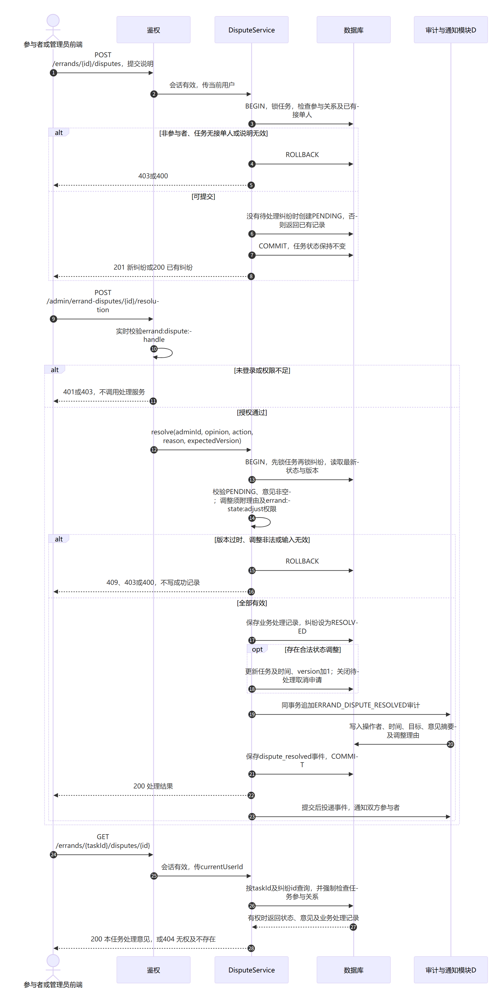

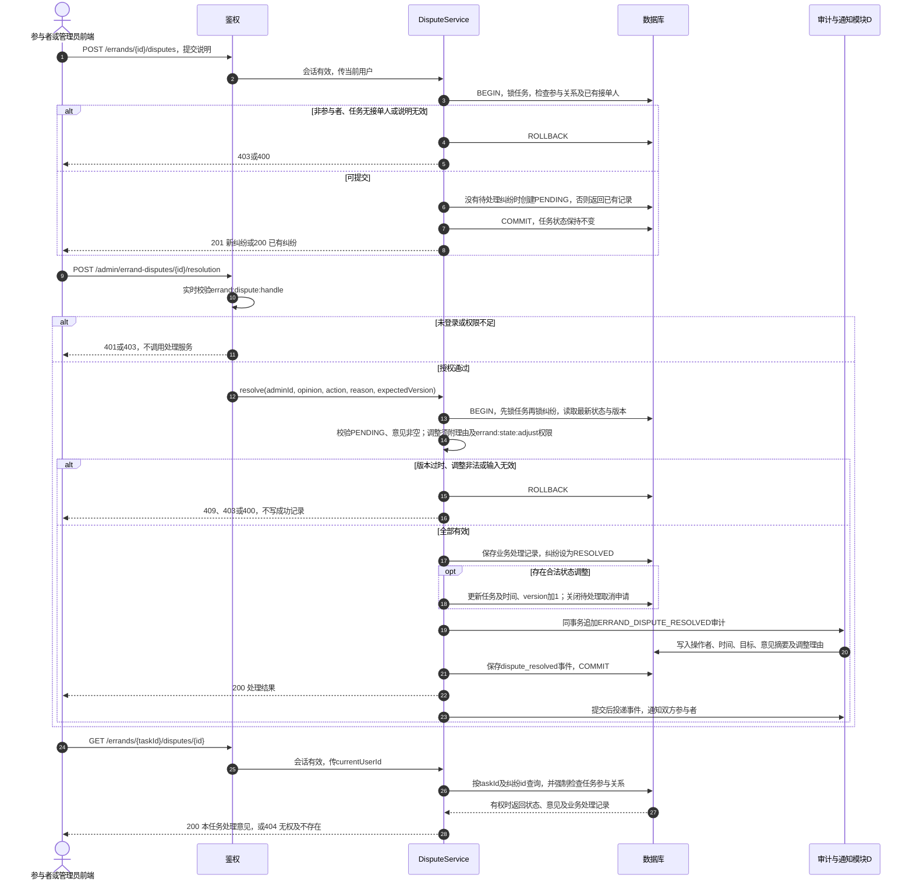
```mermaid
sequenceDiagram
    autonumber
    actor FE as 参与者或管理员前端
    participant Auth as 鉴权
    participant S as DisputeService
    participant DB as 数据库
    participant D as 审计与通知模块D
    FE->>Auth: POST /errands/{id}/disputes，提交说明
    Auth->>S: 会话有效，传当前用户
    S->>DB: BEGIN，锁任务，检查参与关系及已有接单人
    alt 非参与者、任务无接单人或说明无效
        S->>DB: ROLLBACK
        S-->>FE: 403或400
    else 可提交
        S->>DB: 没有待处理纠纷时创建PENDING，否则返回已有记录
        S->>DB: COMMIT，任务状态保持不变
        S-->>FE: 201 新纠纷或200 已有纠纷
    end
    FE->>Auth: POST /admin/errand-disputes/{id}/resolution
    Auth->>Auth: 实时校验errand:dispute:handle
    alt 未登录或权限不足
        Auth-->>FE: 401或403，不调用处理服务
    else 授权通过
        Auth->>S: resolve(adminId, opinion, action, reason, expectedVersion)
        S->>DB: BEGIN，先锁任务再锁纠纷，读取最新状态与版本
        S->>S: 校验PENDING、意见非空；调整须附理由及errand:state:adjust权限
        alt 版本过时、调整非法或输入无效
            S->>DB: ROLLBACK
            S-->>FE: 409、403或400，不写成功记录
        else 全部有效
            S->>DB: 保存业务处理记录，纠纷设为RESOLVED
            opt 存在合法状态调整
                S->>DB: 更新任务及时间、version加1；关闭待处理取消申请
            end
            S->>D: 同事务追加ERRAND_DISPUTE_RESOLVED审计
            D->>DB: 写入操作者、时间、目标、意见摘要及调整理由
            S->>DB: 保存dispute_resolved事件，COMMIT
            S-->>FE: 200 处理结果
            S->>D: 提交后投递事件，通知双方参与者
        end
    end
    FE->>Auth: GET /errands/{taskId}/disputes/{id}
    Auth->>S: 会话有效，传currentUserId
    S->>DB: 按taskId及纠纷id查询，并强制检查任务参与关系
    DB-->>S: 有权时返回状态、意见及业务处理记录
    S-->>FE: 200 本任务处理意见，或404 无权及不存在
```

要点：

- 纠纷业务由 C 负责，不因涉及管理员而移交给 D；管理核查列表与详情使用 `/admin/errand-disputes` 及 `/{id}`，均校验 `errand:dispute:handle`。私人交接信息需额外校验 `errand:private:read`。
- 默认 `action=NONE` 只保存意见。状态调整按 C6 的有限转换白名单检查最新版本，理由必填；管理员仅提交意见时不得意外覆盖任务进度。
- 调整至 `COMPLETED` 要保存 `completedAt`；任何调整到终态同时将待处理取消申请设为 `CLOSED` 并记录关闭人、时间、理由。已终态任务只允许保存意见。
- 业务处理记录、纠纷结案、必要的任务调整、共享审计及待投递事件须一起提交，任一写入失败全部回滚。同一纠纷只能结案一次；重复处理返回既有结果或冲突，不再写审计和事件。
- 审计理由始终非空：未调整任务时使用处理意见作为结案理由；调整任务时使用单独填写的调整理由。业务记录保留完整意见，审计仅保存必要摘要。
- 上图暂按模块共用数据库且审计接口支持传递当前事务设计。若 D 使用独立存储，必须另行确认可靠审计提交方案，不能声称跨存储调用天然具有同一事务。
- 参与者只能看到本任务的意见和处置结果，不能直接访问 D 的管理审计查询接口。不执行任何资金操作。

### 3.7 首次进入与查看宠物（FR-36）

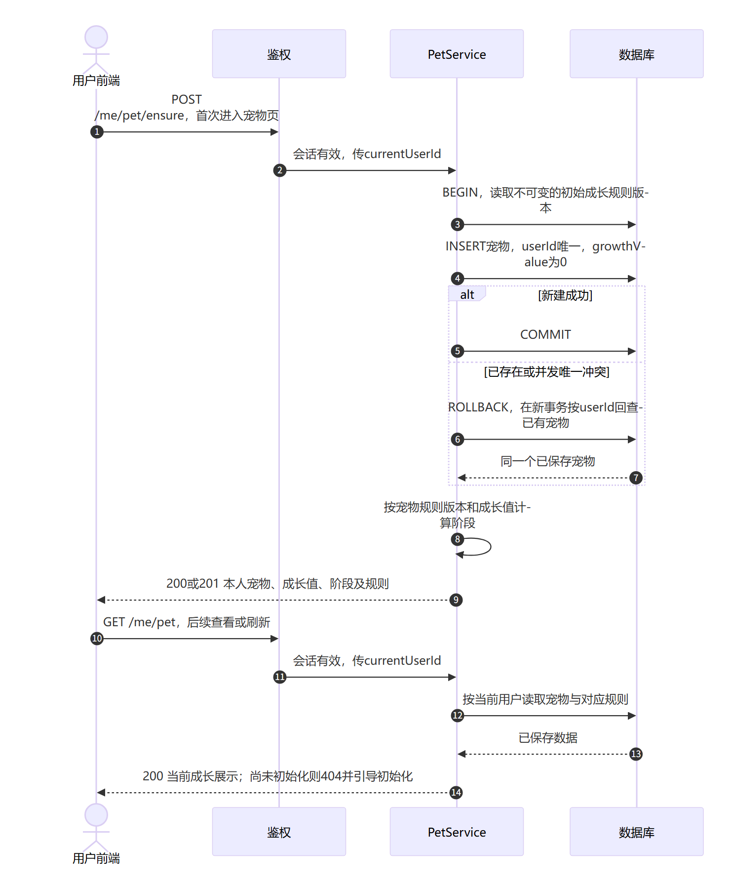

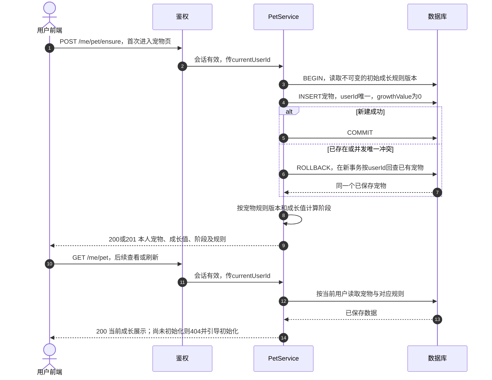
```mermaid
sequenceDiagram
    autonumber
    actor FE as 用户前端
    participant Auth as 鉴权
    participant S as PetService
    participant DB as 数据库
    FE->>Auth: POST /me/pet/ensure，首次进入宠物页
    Auth->>S: 会话有效，传currentUserId
    S->>DB: BEGIN，读取不可变的初始成长规则版本
    S->>DB: INSERT宠物，userId唯一，growthValue为0
    alt 新建成功
        S->>DB: COMMIT
    else 已存在或并发唯一冲突
        S->>DB: ROLLBACK，在新事务按userId回查已有宠物
        DB-->>S: 同一个已保存宠物
    end
    S->>S: 按宠物规则版本和成长值计算阶段
    S-->>FE: 200或201 本人宠物、成长值、阶段及规则
    FE->>Auth: GET /me/pet，后续查看或刷新
    Auth->>S: 会话有效，传currentUserId
    S->>DB: 按当前用户读取宠物与对应规则
    DB-->>S: 已保存数据
    S-->>FE: 200 当前成长展示；尚未初始化则404并引导初始化
```

要点：使用单独的初始化命令承接“首次进入自动创建”，普通 GET 只读。并发冲突回查须在失败事务回滚后执行，读到的是获胜事务提交的同一宠物；若获胜事务失败，则重试初始化，不返回虚构数据。

### 3.8 每日签到（FR-37 / NFR-03）

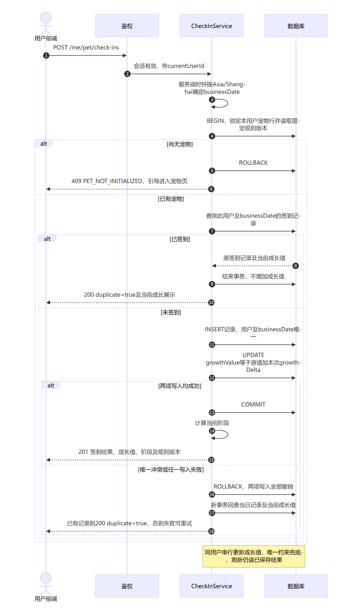

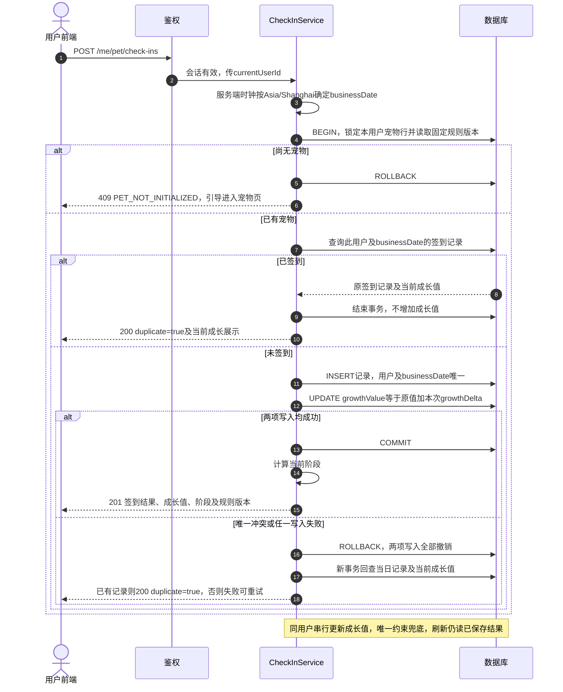
```mermaid
sequenceDiagram
    autonumber
    actor FE as 用户前端
    participant Auth as 鉴权
    participant S as CheckInService
    participant DB as 数据库
    FE->>Auth: POST /me/pet/check-ins
    Auth->>S: 会话有效，传currentUserId
    S->>S: 服务端时钟按Asia/Shanghai确定businessDate
    S->>DB: BEGIN，锁定本用户宠物行并读取固定规则版本
    alt 尚无宠物
        S->>DB: ROLLBACK
        S-->>FE: 409 PET_NOT_INITIALIZED，引导进入宠物页
    else 已有宠物
        S->>DB: 查询此用户及businessDate的签到记录
        alt 已签到
            DB-->>S: 原签到记录及当前成长值
            S->>DB: 结束事务，不增加成长值
            S-->>FE: 200 duplicate=true及当前成长展示
        else 未签到
            S->>DB: INSERT记录，用户及businessDate唯一
            S->>DB: UPDATE growthValue等于原值加本次growthDelta
            alt 两项写入均成功
                S->>DB: COMMIT
                S->>S: 计算当前阶段
                S-->>FE: 201 签到结果、成长值、阶段及规则版本
            else 唯一冲突或任一写入失败
                S->>DB: ROLLBACK，两项写入全部撤销
                S->>DB: 新事务回查当日记录及当前成长值
                S-->>FE: 已有记录则200 duplicate=true，否则失败可重试
            end
        end
    end
    Note over S,DB: 同用户串行更新成长值，唯一约束兜底，刷新仍读已保存结果
```

要点：

- 行锁保护同一用户跨日期并发及成长值更新，唯一约束保护同日去重；不采用先读成长值再无锁覆盖的写法。
- 签到记录保存本次 `growthDelta` 和 `ruleVersion`；事务失败不会留下“有签到无成长”或“有成长无签到”。在提交前取好返回快照，避免另一次签到提交后拼出不一致展示。
- 唯一键必须使用服务端确定的北京时间日期，不能用 UTC 日期或客户端时间；并发和重复请求只有一条记录、一次奖励。
- 日期边界验收覆盖北京时间 23:59:59 与次日 00:00:00、同日响应中断重试、首次并发访问后签到及写入中途故障回滚。

## 4. 跨模块接口约定

### 4.1 责任和接口

| 对接方 | 需要对方确认或提供 | C 提供与负责 |
| --- | --- | --- |
| A：账号与安全 / 共享授权 | 当前登录用户 `currentUserId`；会话失效；任务发布权限；管理员实时权限查询 | 发布者、接单人、指定答复人及宠物归属校验；权限点提案 `errand:dispute:handle`、`errand:state:adjust`、`errand:private:read`，不复制用户和 RBAC 模型 |
| D：通知（FR-29） | `notify(eventId, type, recipientIds, targetType, targetId, payload)`；事件号去重、重试反馈及跳转权限检查 | 提交后投递，C 维护待投递事件及重试；提供接收人和最小载荷，维护任务详情与参与者查询，不在载荷中放私人交接内容 |
| D：管理审计（NFR-06） | `appendAudit(currentTransaction, operatorId, action, targetType, targetId, reason, extra)`；只追加及授权查询 | 纠纷业务处理记录；审计动作 `ERRAND_DISPUTE_RESOLVED`、目标 `ERRAND_DISPUTE`；`extra` 记录 taskId、前后状态、业务记录号，不写私人交接原文 |
| D：备份与恢复（NFR-05） | 备份清单格式、同一恢复时点、事件恢复后去重及演练流程 | 任务、取消申请、纠纷、处理记录、宠物、签到、规则版本、发布回执及待投递事件的数据关系与核对项 |
| B：提交可靠性（故事25 / NFR-04） | 发布提交的幂等键生成、传递、表单保留、摘要规范和结果查询方式；共享组件及保留窗口 | 跑腿发布落库、唯一约束和事务；覆盖未送达及保存后响应中断两种重试，确保同一次提交最多创建一个任务 |

D 同学文档将公共权限支撑及审计列为共享能力。本表中的 A 表示账号与安全对接职责，不另建一套权限系统；权限 API、归属及事务能力由 A / D 共同确认。

### 4.2 通知事件与可靠投递

| 事件类型（提案） | 触发时点 | 接收人 | 最小载荷 |
| --- | --- | --- | --- |
| `errand.accepted` | 接单成功提交后 | 发布者 | taskId、任务概要、当前状态 |
| `errand.completion_submitted` | 接单人提交完成后 | 发布者 | taskId、当前状态 |
| `errand.completed` | 发布者确认完成后 | 接单人 | taskId、当前状态 |
| `errand.cancellation_requested` | 首次创建待处理申请后 | 指定另一参与者 | taskId、requestId、当前状态 |
| `errand.cancellation_decided` | 另一方同意或拒绝后 | 申请人 | taskId、requestId、决定、任务当前状态 |
| `errand.dispute_resolved` | 管理员结案提交后 | 发布者及接单人，去重 | taskId、disputeId、是否调整状态；意见到业务页查看 |

事件公共字段为 `eventId, type, occurredAt, recipientIds, targetType, targetId, payload`。事件随业务事务落库，提交后由投递器调用 D，确认成功后标记已投递；失败重试沿用同一 `eventId`。D 按 `(eventId, recipientId)` 去重，通知跳转时再次查询当前访问权限，不以历史载荷作为授权依据。按任务版本顺序投递或在展示时读取当前状态，避免旧事件覆盖新进度。

### 4.3 数据恢复核对

| 数据组 | 必须恢复与核对的关系 |
| --- | --- |
| 任务与参与者 | taskId、发布者、接单人与账号引用完整；接单人与发布者不同；状态、版本与关键时间有效；终态不可重新接取 |
| 取消申请 | 任务与双方引用完整，每任务最多一条PENDING；APPROVED对应任务CANCELLED；管理员终结后的PENDING已关闭 |
| 纠纷与处理记录 | 任务、提交者与管理员引用完整；RESOLVED有且仅有一条业务处理记录，并可关联共享审计；意见、理由和前后状态保存完整 |
| 宠物与签到 | 每用户最多一个宠物；每用户每北京时间日期最多一条签到；签到归属与宠物一致；规则版本可读取；成长值等于奖励累计 |
| 发布回执与事件 | 回执可定位原任务并保留请求摘要；事件与已提交业务一致；恢复后沿用原事件号投递，避免重发重复通知；已成功的发布重试不新建任务 |

上述数据应按一致恢复时点备份；核对清单包含记录数、关键字段校验和及外键完整性，不能只对比总行数。演练需用恢复后的账号查看本人任务及宠物，并执行一次合法操作验证约束仍有效。备份频率、保留期、恢复目标由全组确认。

### 4.4 待确认项

| 编号 | 需确认的决定 | 暂用方案及影响位置 |
| --- | --- | --- |
| C-TBD-01 | 截止时间是接单期限还是履约期限，超时是否需提醒或结案 | 暂仅限制接单；§0 C2、§2.1、§3.3 |
| C-TBD-02 | 取消待处理时能否继续完成；是否提供撤回、答复时限 | 暂暂停完成、不自动同意；§2.2、§3.4 / §3.5 |
| C-TBD-03 | 管理员可调整状态的白名单、终态纠纷受理期限 | 暂按 C5 / C6，不复活终态；§3.6 |
| C-TBD-04 | 签到奖励、阶段名称及阈值、规则升级策略 | 使用不可变版本配置，正式数值未定；§1.2、§2.3、§3.8 |
| C-TBD-05 | 发布权限与三个管理权限点由谁维护、查询接口和撤销生效方式 | 复用 A / D 公共能力，管理权限实时检查；§4.1 |
| C-TBD-06 | B 的发布幂等协议与窗口、D 的事件去重及事务审计能力 | 暂按同数据库事务与持久事件设计；§3.2、§3.6、§4.2 |
| C-TBD-07 | 字段长度、金额上限、筛选排序、私人交接信息最小字段 | 暂提供概要和报酬，私人字段独立查询；§3.1 / §3.2 |

## 5. 需求覆盖与绘图分工

### 5.1 故事编号 → FR / NFR → 图编号

| 用户故事 | 对应需求 | 图编号 | 关键覆盖点 |
| --- | --- | --- | --- |
| 21 浏览与筛选跑腿任务 | FR-30 | 2.1、3.1、3.3 | 默认未过期待接单；显式筛选；到期不可接取 |
| 32 发布并确认有偿跑腿任务 | FR-31 | 1.1、2.1、3.2、3.4 | 内容、报酬与截止校验；发布待接单；发布者确认；仅记录线下报酬 |
| 33 接取有偿跑腿任务 | FR-32 | 1.1、2.1、3.3、3.4 | 禁止自接单；并发唯一成功；仅接单人提交完成 |
| 34 查看自己参与的跑腿任务 | FR-33 | 1.1、3.1 | 本人发布与接取分别查询；私人交接只向参与者及授权管理接口开放 |
| 35 取消跑腿任务 | FR-34 | 1.1、2.1、2.2、3.5 | 待接单直接取消；接单后需另一方同意；申请不等于已取消 |
| 36 反馈跑腿任务纠纷 | FR-35 | 1.1、2.1、3.6 | 提交、授权处理、意见与理由记录、必要调整及参与者查看 |
| 22 查看虚拟宠物成长 | FR-36 | 1.2、2.3、3.7 | 首次唯一初始化；持久化成长值；展示阶段和规则 |
| 10 签到培养虚拟宠物 | FR-37 | 1.2、2.3、3.8 | 北京时间自然日、同日只奖励一次、刷新一致 |
| 24 数据一致性 | NFR-03 | 1.2、3.3、3.7、3.8 | 原子接单；唯一初始化；签到唯一键及同事务奖励 |
| 25 提交可靠性（与B交叉） | NFR-04 | 1.1、3.2 | 保留表单与幂等键，失败及响应中断均可安全重试 |
| 18 查看互动与业务通知（与D交叉） | FR-29 | 3.3—3.6、§4.2 | 任务进度事件、接收人、提交后投递及权限跳转 |
| 41 / 42 管理授权与访问安全（交叉） | FR-22 / NFR-02 | 3.1、3.4—3.8 | 会话、资源归属、管理权限实时检查，越权无读取及修改 |
| 43 数据可恢复性（与D交叉） | NFR-05 | §4.3 | 一致备份、关联关系、成长值及事件回执恢复核对 |
| 44 管理操作可追溯性（复用公共能力） | NFR-06 | 1.1、3.6、§4.1 | 为跑腿纠纷补充只追加业务记录与公共审计；不替代故事44原有治理场景验收 |

### 5.2 图例清单

| 序号 | 类型 | 图编号与名称 | PNG |
| --- | --- | --- | --- |
| 01 | 类图 | 1.1 跑腿任务核心类图 | [查看](C-fig/01-1.1-跑腿任务核心类图.png) |
| 02 | 类图 | 1.2 宠物与签到类图 | [查看](C-fig/02-1.2-宠物与签到类图.png) |
| 03 | 状态图 | 2.1 跑腿任务生命周期 | [查看](C-fig/03-2.1-跑腿任务生命周期.png) |
| 04 | 状态图 | 2.2 取消申请生命周期 | [查看](C-fig/04-2.2-取消申请生命周期.png) |
| 05 | 状态图 | 2.3 宠物初始化与成长 | [查看](C-fig/05-2.3-宠物初始化与成长.png) |
| 06 | 时序图 | 3.1 浏览任务和查看本人任务 | [查看](C-fig/06-3.1-浏览任务和查看本人任务.png) |
| 07 | 时序图 | 3.2 发布任务 | [查看](C-fig/07-3.2-发布任务.png) |
| 08 | 时序图 | 3.3 接单 | [查看](C-fig/08-3.3-接单.png) |
| 09 | 时序图 | 3.4 提交完成与确认完成 | [查看](C-fig/09-3.4-提交完成与确认完成.png) |
| 10 | 时序图 | 3.5 取消任务 | [查看](C-fig/10-3.5-取消任务.png) |
| 11 | 时序图 | 3.6 反馈、处理和查看纠纷 | [查看](C-fig/11-3.6-反馈处理和查看纠纷.png) |
| 12 | 时序图 | 3.7 首次进入与查看宠物 | [查看](C-fig/12-3.7-首次进入与查看宠物.png) |
| 13 | 时序图 | 3.8 每日签到 | [查看](C-fig/13-3.8-每日签到.png) |

绘图与分工备注：

- C 负责两张类图、三张状态图、八张时序图；纠纷处理属于 C 的业务交付，公共鉴权、审计及通知接口分别与 A / D 对齐。
- `User / Role / Permission / Notification / AdminAuditLog` 复用对应负责人定义，不在本图新增同名但不同含义的共享实体。
- 修改 Mermaid 后同步更新对应 PNG；编号、图片文件名与 §5.1 覆盖表保持一致。所有待确认项在 §0 和 §4.4 可定位。

### 5.3 后续实现验收检查点

| 场景 | 预期结果 |
| --- | --- |
| 多用户并发抢同一任务；发布者自接单；到期瞬间接单 | 仅一名非发布者能成功；过期更新零行；无额外接单事件 |
| 未接单任务取消与接单竞争 | 任务最终只会落在一次有效变更后的状态，不出现已取消仍成功接取 |
| 完成、取消答复、管理员调整并发 | 统一锁任务并校验最新状态；不覆盖终态；待处理申请关闭或明确阻止完成 |
| 未登录、无关第三方、权限已撤销管理员直接请求接口 | 不泄露私人交接和纠纷意见，不推进任务，不生成成功记录 |
| 发布请求未送达与成功后响应中断 | 表单保留；同键重试最多一个任务；同键不同内容被拒绝 |
| 同用户多窗口首次进入宠物页 | 只生成一只宠物，返回同一标识，不重置成长值 |
| 同日并发签到、零点跨日签到、任一写入中途失败 | 同日只一条奖励；按北京时间日期区分；失败完整回滚 |
| 通知投递失败及重复投递；审计写入失败 | 业务事件可重试且通知去重；审计失败时纠纷结案整体回滚 |
| 隔离恢复后查询及再次操作 | 任务关系与宠物成长一致，幂等和唯一约束继续生效 |

本交付为设计初稿，检查点用于后续实现验收；不表示已执行上述运行期并发、事务或恢复测试。
